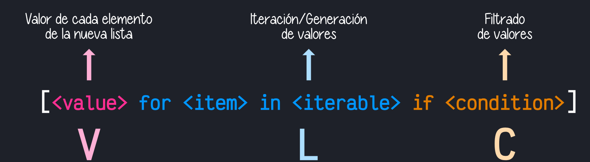

# 🐍 Clase 01 - Comprehensions

# Parte 1 - Comprehensions - Comprensiones

# ¿Qué son las comprehensions?

<aside>
💡

- Las **comprehensions** ofrecen una forma fácil y compacta de crear **listas, conjuntos y diccionarios**.
- Una comprehension funciona **recorriendo o iterando** sobre elementos y **asignándolos a un contenedor** como lista, conjunto o diccionario.
- Este contenedor **no puede ser una tupla**, ya que al ser inmutable no puede recibir asignaciones.
</aside>

---

## List Comprehension (Comprensión de listas)

- Una comprensión de lista consiste en **corchetes** que contienen una **expresión** seguida de una cláusula `for`, y cero o más cláusulas `for` o `if`.
- La forma general de una comprensión de lista es:

```python
lst = [expresión for var in secuencia [opcional for and/or if]]
```



A continuación se presenta un diagrama con la transformación de la estructura clásica en listas por comprensión:


## Ejemplos de list comprehension:

```python
# Generar 20 números aleatorios en el rango de 10 a 100
import random
a = [random.randint(10, 100) for n in range(20)]
```

```python
[63, 19, 53, 95, 84, 37, 22, 32, 67, 34, 93, 35, 20, 97, 35, 49, 62, 51, 93, 15]

```

```python
# Generar cuadrado y cubo de todos
# los números entre 0 y 10
a = [(x, x**2, x**3) for x in range(10)]
print(a)
```

```python
[(0, 0, 0), (1, 1, 1), (2, 4, 8), (3, 9, 27), (4, 16, 64), (5, 25, 125), (6, 36, 216), (7, 49, 343), (8, 64, 512), (9, 81, 729)]
```

```python
# Convertir una lista de strings a una lista de enteros
a = [int(x) for x in ['10', '20', '30', '40']]
print(a)
```

```python
# Convertir una lista de strings a una lista de enteros
z = ['10', '20', '30', '40']
a = [int(x) for x in ]
print(a)
```

```python
[10, 20, 30, 40]
```

### Ejemplos del uso de if en list comprehension:

```python
# Generar una lista de números pares en el rango de 10 a 30
a = [n for n in range(10, 30) if n % 2 == 0]
print(a)
```

```python
[10, 12, 14, 16, 18, 20, 22, 24, 26, 28]
```

```python
# De una lista, eliminar todos los números con valor entre 20 y 50
a = [num for num in a if num < 20 or num > 50]
print(a)
```

```python
[10, 12, 14, 16, 18]
```

### Ejemplo del uso de if-else en list comprehension:

```python
# Cuando se usan if-else, se colocan antes del for
# Reemplazar una vocal en una cadena con !
a = ['!' if alphabet in 'aeiou' else alphabet for alphabet in 'Technical']
print(a)
```

```python
['T', '!', 'c', 'h', 'n', '!', 'c', '!', 'l']
```

### Ejemplo del uso de múltiples for y if en list comprehension:

```python
# Aplanar una lista de listas
arr = [[1,2,3,4], [5,6,7,8], [10, 11, 12, 13]]
b = [n for ele in arr for n in ele]  # una forma
```

```python
[1, 2, 3, 4, 5, 6, 7, 8, 10, 11, 12, 13]
```

```python
# * puede usarse para desempaquetar una lista
c = [*arr[0], *arr[1], *arr[2]]  # otra forma
```

```python
[1, 2, 3, 4, 5, 6, 7, 8, 10, 11, 12, 13]
```

### Nota la diferencia entre for anidado en list comprehension y comprensión anidada:

```python
# Produce [4, 5, 6, 5, 6, 7, 6, 7, 8]. Usa for anidado
lst = [a + b for a in [1, 2, 3] for b in [3, 4, 5]]
print(lst)
```

```python
[4, 5, 6, 5, 6, 7, 6, 7, 8]
```

```python
# Produce [[4, 5, 6], [5, 6, 7], [6, 7, 8]]. Usa comprensión anidada
lst = [[a + b for a in [1, 2, 3]] for b in [3, 4, 5]]
print(lst)
```

```python
[[4, 5, 6], [5, 6, 7], [6, 7, 8]]
```

> Piensa en el primer for como bucle externo y el segundo como bucle interno.
> 

## Ejemplo del uso de múltiples for y if en list comprehension:

```python
# Generar todas las combinaciones únicas de 1, 2 y 3
a = [(i, j, k) for i in [1,2,3] for j in [1,2,3] for k in [1, 2, 3] if i != j and j != k and k != i]
```

```python
[(1, 2, 3), (1, 3, 2), (2, 1, 3), (2, 3, 1), (3, 1, 2), (3, 2, 1)]
```

# 🔹 **Set Comprehension (Comprensión de conjuntos)**

<aside>

- Al igual que las **list comprehensions**, las **set comprehensions** ofrecen una forma fácil de crear **conjuntos**.
- Consisten en **llaves** `{}` que contienen una **expresión** seguida de una cláusula `for`, y opcionalmente más `for` o `if`.
</aside>

Sintaxis general:

```python
s = {expresión for var in secuencia [if condición] [for ...]}
```

---

### ✅ **Ejemplos de set comprehension**

```python
# Generar un conjunto con los cuadrados de números del 0 al 9
a = {x**2 for x in range(10)}
# → {0, 1, 4, 9, 16, 25, 36, 49, 64, 81}
```

```python
{0, 1, 64, 4, 36, 9, 16, 49, 81, 25}
```

```python
# De un conjunto, eliminar todos los números entre 20 y 50
a = {num for num in a if num > 20 and num < 50}
```

```python
{49, 36, 25}
```

# 🔹 **Dictionary Comprehension (Comprensión de diccionarios)**

<aside>

- Permite crear **diccionarios** de forma compacta a partir de iterables.
- Usa **llaves** {} y la sintaxis: {clave: valor for (clave, valor) in iterable}
</aside>

Sintaxis General

```python
dict_var = {clave: valor for (clave, valor) in diccionario.items()}
```

### ✅ Ejemplos de dictionary comprehension

```python
# Diccionario inicial
d = {'a': 1, 'b': 2, 'c': 3, 'd': 4}
```

```python
# Obtener diccionario con cada valor al cubo
d1 = {k: v ** 3 for (k, v) in d.items()}
print(d1)
```

```python
{'a': 1, 'b': 8, 'c': 27, 'd': 64}
```

```python
# Solo los valores mayores a 3,
d2 = {k: v ** 3 for (k, v) in d.items() if v > 3}
print(d2)

```

```python
{'d': 64}
```

```python
# Identificar entradas pares e impares
d3 = {k: ('Even' if v % 2 == 0 else 'Odd') for (k, v) in d.items()}
print(d3)
```

```python
{'a': 'Odd', 'b': 'Even', 'c': 'Odd', 'd': 'Even'}
```

---

# Parte 02 - Programación Funcional

<aside>
💡

En la programación funcional, un problema se trata como la evaluación de una o más funciones. Por lo tanto, un problema dado se descompone en un conjunto de funciones. Estas funciones proporcionan la principal fuente de lógica en el programa.

</aside>

## Funciones como Valores de Primera Clase

Python facilita la programación funcional al tratar las funciones como valores de datos "de primera clase". Esto significa que: las funciones pueden asignarse a variables y luego llamarse usando estas variables.

```python
def saludar():
    print("¡Hola!")

# Asignamos la función a una variable
mi_funcion = saludar()
```

```python
¡Hola!
```

Las funciones pueden pasarse como argumentos a funciones y devolverse desde funciones. 

```python
def aplicar(funcion, valor):
    return funcion(valor)

def cuadrado(x):
    return x * x
```

**Pasamos la función `cuadrado` como argumento**

```python
resultado = aplicar(cuadrado, 5)
```

```python
25
```

### Función que devuelve otra función

```python
def crear_multiplicador(n):
    def multiplicar(x):
        return x * n
    return multiplicar
```

```python
duplicar = crear_multiplicador(2)
print(duplicar(10))
```

```python
20
```

```python
triplicar = crear_multiplicador(3)
print(triplicar(30))
```

```python
90
```

Las funciones pueden construirse en tiempo de ejecución, de la misma manera que se pueden construir listas, tuplas, etc.

Creamos funciones dentro de otra función, en tiempo de ejecución

```python

def construir_funcion_operacion(operador):
    def sumar(x, y):
        return x + y

    def restar(x, y):
        return x - y

    if operador == 'sumar':
        return sumar
    elif operador == 'restar':
        return restar
    else:
        raise ValueError("Operador no soportado")

```

Usamos la función para crear otra función en tiempo de ejecución

```python
operacion = construir_funcion_operacion('restar')
print(operacion(10, 4))
```

```python
6
```

```python
otra_operacion = construir_funcion_operacion('sumar')
print(otra_operacion(3, 7))
```

```python
10
```

## Ejemplos de construcción de funciones en tiempo de ejecución: Funciones Lambda


<aside>

- Las funciones normales tienen nombre. Se definen con la palabra clave `def`.
- Las funciones `lambda` se utilizan normalmente para funciones cortas que es conveniente definir en el punto en el que se llaman.
- Las funciones `lambda` también se denominan funciones anónimas o funciones en línea.
- Una función `lambda` puede recibir cualquier número de argumentos, pero sólo puede devolver un valor.
</aside>

### Otros ejemplos de funciones lambda

Función que calcula el cubo de un número:

```python
def cubo(a):
    return a**3

b = cubo
print(b(8))
```

Salida:

```
512
```

```python
cubo = lambda a: a**3

b = cubo
print(b(8))
```

Salida:

```
512
```

## Otros ejemplos de funciones lambda

Función que recibe 3 argumentos y devuelve el promedio de ellos:

```python
def promedio(x, y, z):
    return (x + y + z) / 3

print(promedio(2, 4, 11))
```

Salida:

```
5.666666666666667
```

Con lambda:

```python
promedio = lambda x, y, z: (x + y + z) / 3

print(promedio(2, 4, 11))
```

Salida:

```
5.666666666666667
```

## Mas ejemplos de funciones lambda

Función que recibe nombre y apellido para imprimirlo

```python
def nomb_comp(Nombre, Apellido):
    return f'El nombre completo es: {Nombre} {Apellido}'

x = nomb_comp
print(x('Nicolás', 'Pérez'))
```

Salida:

```
El nombre completo es: Nicolás Pérez
```

Con lambda:

```python
nomb_comp = lambda Nombre, Apellido: f'El nombre completo es: {Nombre} {Apellido}'

t = nomb_comp('Nicolás', 'Pérez')
print(t)
```

Salida:

```
El nombre completo es: Nicolás Pérez
```

También pueden ser pasadas directamente al `print()`

```python
def promedio(x, y, z):
    return (x + y + z) / 3

print(promedio(2, 4, 11))
```

Salida:

```
5.666666666666667
```

Con lambda + print()

Salida:

```python
print((lambda x, y, z: (x + y + z) / 3)(2, 4, 11))
```

```
5.666666666666667
```

Mas ejemplos:

salida:

```python
def cubo(a):
    return a**3

b = cubo
print(b(8))
```

```
512
```

Se puede hacer así:

```python
print((lambda a: a**3)(8))

```

Salida:

```
512
```

Lambda también puede asignarse a una variable y luego invocarse:

Salida:

```python
p = lambda a: a**3
print(p(8))

```

```
512
```

```python
q = lambda x, y, z: (x + y + z) / 3
print(q(2, 4, 11))

```

Salida:

```
5.666666666666667
```

Los datos tipos contenedores (listas, tuplas, entre otros) también pueden pasarse a una función `lambda`. Por ejemplo, una función `lambda` que calcula la media de los números de una lista puede pasarse a la función `print()`:

```python
lista_1 = [1, 2, 3, 4, 5]
print((lambda L1: sum(L1)/len(L1))(lista_1))

```

salida:

```
3.0
```

```python
tupla_2 = (1, 2, 3, 4, 5)
print((lambda t2: sum(t2)/len(t2))(tupla_2))

```

salida:

```
3.0
```

---

## Funciones de orden superior.

Una función de orden superior es una función que puede recibir otras funciones como argumentos o devolverlos:

```python
def incrementar(x):
    return x + 1

def func_orden_sup(x, func):
    return x + func(x)

resultado = func_orden_sup(2, incrementar)
# 2 + (2 + 1)
print(resultado)
```

salida:

```
5
```

¿Cómo sería con lambda?

```python
incrementar = lambda x: x + 1

func_orden_sup = lambda x, func: x + func(x)

resultado = func_orden_sup(2, incrementar)
print(resultado)
```

salida:

```
5
```

Otro ejemplo, podemos pasar una función lambda a la función `built-in` llamada `sorted()` para ordenar un diccionario por valores:

```python
d = {'Aceite': 230, 'Pan': 150, 'Salmón': 175, 'Jamón': 35}
d1 = sorted(d.items(), key = lambda a: a[1])
print(d1)
```

salida:

```
[('Jamón', 35), ('Pan', 150), ('Salmón', 175), ('Aceite', 230)
```

Para facilitar la programación funcional, Python proporciona 3 funciones de orden superior: `map()`, `filter()` y `reduce()`.

### `map()`: su objetivo principal es hacer transformaciones a una lista dada de elementos.

🧾 **Sintaxis general de `map()`**

```python
map(funcion, iterable)
```

### ✅ **Parámetros:**

- `funcion`: Una función que se aplicará a cada elemento del iterable. Puede ser:
    - una función definida con `def`
    - una función anónima `lambda`
- `iterable`: Una secuencia como una lista, tupla, conjunto, etc.

> Nota: Si usas map() en Python 3, devuelve un objeto iterable tipo map, por lo que normalmente se convierte a lista con list().
> 


```python
numeros = [1, 2, 3, 4]
numeros_2 = []
for i in numeros:
    numeros_2.append(i * 2)
print(numeros)
print(numeros_2)
```

salida:

```
[1, 2, 3, 4]
[2, 4, 6, 8]
```

Esto se puede hacer en una sola línea usando `map()` y `lambda`:

```python
numeros = [1, 2, 3, 4]
numeros_3 = list(map(lambda i: i*2, numeros))
print(numeros_3)
```

salida:

```
[2, 4, 6, 8]
```

con set()

```python
numeros = [1, 2, 3, 4]
numeros_3 = set(map(lambda i: i*2, numeros))
print(numeros_3)

```

salida:

```
{8, 2, 4, 6}
```

Con tuplas

```python
numeros_3 = tuple(map(lambda i: i*2, numeros))
print(numeros_3)

```

salida:

```
(2, 4, 6, 8)
```

Mas ejemplos con `map()`

```python
numeros_4 = [1, 2, 3, 4]
numeros_5 = [5, 6, 7]
print(numeros_4)
print(numeros_5)
print()
resultado = list(map(lambda x, y: x + y, numeros_4, numeros_5))
print(resultado)
```

salida:

```
[1, 2, 3, 4]
[5, 6, 7]

[6, 8, 10]
```

Uso de `map()` con diccionarios, compara con el codigo sin usar lambda y map

```python
# Items ordenes de compra almacenada en una lista de diccionarios
items = [
    {
        'producto': 'camisa',
        'precio': 100,
    },
    {
        'producto': 'pantalones',
        'precio': 300
    },
    {
        'producto': 'pantalones 2',
        'precio': 200
    }
]

# Quiero transformar esa información a una lista que
# solo contenga los precios: precios = [100, 200, 300]

precios = list(map(lambda item: item['precio'], items))
print(precios)
```

salida:

```
[100, 300, 200]
```

Sin lambda y map

```python
# Items ordenes de compra almacenadas en una lista de diccionarios
items = [
    {
        'producto': 'camisa',
        'precio': 100,
    },
    {
        'producto': 'pantalones',
        'precio': 300,
    },
    {
        'producto': 'pantalones 2',
        'precio': 200
    }
]

# Función que recibe la lista de items y extrae los precios
def obtener_precios(lista_items):
    precios = []
    for item in lista_items:
        precios.append(item['precio'])
    return precios

# Usamos la función
precios = obtener_precios(items)
print(precios)
```

Supongamos que a la lista original le falta añadir un atributo, digamos: impuestos. En este caso no se puede hacer solo con lambda ya que la operación de añadir esa clave impuestos a la lista no se hace en una sola línea:

```python
def añadir_impuestos(item):
    item['impuestos'] = item['precio'] * .15
    return item

new_items = list(map(añadir_impuestos, items))
print(new_items)
```

Salida:

```
[{'producto': 'camisa', 'precio': 100, 'impuestos': 15.0}, {'producto': 'pantalones', 'precio': 300, 'impuestos': 45.0}, {'producto': 'pantalones 2', 'precio': 200, 'impuestos': 30.0}]
```

### `filter()`. Filtrar elementos de una lista. Se seleccionan ciertos elementos para que pertenezcan a una nueva lista.

🧾 **Sintaxis de `filter()`**

```python
filter(funcion, iterable)
```

### ✅ **Parámetros:**

- `funcion`: Una función que devuelve `True` o `False` para cada elemento. Solo los elementos que hagan que esta función devuelva `True` serán incluidos en el resultado.
    - Puede ser una función definida con `def` o una `lambda`.
- `iterable`: Una secuencia como una lista, tupla, etc.

> 🔁 Al igual que map(), filter() devuelve un objeto iterable tipo filter, por lo tanto, se suele convertir en list() para ver el resultado.
> 


```python
numbers = [1,2,3,4,5]
print(numbers)
new_numbers = list(filter(lambda x: x % 2 == 0, numbers))
print(new_numbers)
```

salida:

```
[1, 2, 3, 4, 5]
[2, 4]
```

sin funciones de orden superior

```python
numbers = [1, 2, 3, 4, 5]
print(numbers)

def es_par(x):
    return x % 2 == 0

new_numbers = []
for numero in numbers:
    if es_par(numero):
        new_numbers.append(numero)

print(new_numbers)

```

Otro ejemplo:

Dada la siguiente lista de diccionarios:

```python
matches = [
    {
        'home_team': 'España',
        'away_team': 'Italia',
        'home_team_score': 3,
        'away_team_score': 1,
        'home_team_result': 'Win'
    },
    {
        'home_team': 'Francia',
        'away_team': 'Alemania',
        'home_team_score': 1,
        'away_team_score': 1,
        'home_team_result': 'Draw'
    },
    {
        'home_team': 'Portugal',
        'away_team': 'Suiza',
        'home_team_score': 5,
        'away_team_score': 0,
        'home_team_result': 'Win'
    },
]
# Necesitamos filtrar solo los equipos locales que ganaron
```

### Necesitamos filtrar solo los equipos locales que ganaron

---

Veamos el estado original

```python
# Veamos el estado original
print(matches)
```

salida:

```
[{'home_team': 'España', 'away_team': 'Italia', 'home_team_score': 3, 'away_team_score': 1, 'home_team_result': 'Win'}, {'home_team': 'Francia', 'away_team': 'Alemania', 'home_team_score': 1, 'away_team_score': 1, 'home_team_result': 'Draw'}, {'home_team': 'Portugal', 'away_team': 'Suiza', 'home_team_score': 5, 'away_team_score': 0, 'home_team_result': 'Win'}]
```

---

Veamos el nro de partidos

```python
print(len(matches))

```

salida:

```
3
```

---

```python
new_list = list(filter(lambda item: item['home_team_result'] == 'Win', matches))
print(new_list)
print(len(new_list))
```

salida:

```
[{'home_team': 'España', 'away_team': 'Italia', 'home_team_score': 3, 'away_team_score': 1, 'home_team_result': 'Win'}, {'home_team': 'Portugal', 'away_team': 'Suiza', 'home_team_score': 5, 'away_team_score': 0, 'home_team_result': 'Win'}]
2
```

---

```python
lst1 = ['A', 'X', 'Y', '3', 'M', '4', 'D']
f1 = filter(str.isalpha, lst1)
print(list(f1))
```

salida:

```
['A', 'X', 'Y', 'M', 'D']
```

---

Código con filter y def (sin lambda)

```python
def fun(n):
    if n % 5 == 0:
        return True
    else:
        return False

lst2 = [5, 10, 18, 27, 25]
f2 = filter(fun, lst2)
print(list(f2))
```

salida:

```
[5, 10, 25]
```

Código con lambda + filter

```python
lst2 = [5, 10, 18, 27, 25]

# Usamos lambda en lugar de la función 'fun'
f2 = filter(lambda n: n % 5 == 0, lst2)

print(list(f2))
```

salida:

```
[5, 10, 25]
```

---

### `reduce()`. "Reducir a un único valor".

🧾 **Sintaxis general de `reduce()`**

```python
from functools import reduce

reduce(funcion, iterable[, valor_inicial])
```

### ✅ **Parámetros:**

1. **`funcion`**:
    
    Una función que toma dos argumentos y devuelve un valor. Esta función se aplica acumulativamente a los elementos del iterable.
    
2. **`iterable`**:
    
    Una secuencia como lista, tupla, etc.
    
3. **`valor_inicial`** (opcional):
    
    Valor inicial que se usa como primer argumento en la primera llamada.
    

---

---


---


**Ejemplo**: Se tiene una lista de números enteros  `numbers = [1, 2, 3, 4]`
Utiliza la función `reduce()` del módulo `functools` junto con una función `lambda` para calcular la **suma acumulada** de todos los elementos de la lista. La función `lambda` debe recibir dos parámetros: un **acumulador (`counter`)** y un **elemento actual (`item`)**, y devolver la suma de ambos.

```python
import functools

numbers = [1, 2, 3, 4]
result = functools.reduce(lambda counter, item: counter + item, numbers)
print(result)
```

salida:

```
10
```

| Iteration | Counter | Item | Return |
| --- | --- | --- | --- |
| 1 | 0 | 1 | 1 |
| 2 | 1 | 2 | 3 |
| 3 | 3 | 3 | 6 |
| 4 | 6 | 4 | 10 |

---

---

---

Versión sin funciones de orden superior

```python
numbers = [1, 2, 3, 4]

def sumar_lista(lista):
    total = 0
    for numero in lista:
        total += numero
    return total

result = sumar_lista(numbers)
print(result)

```

salida:

```
10
```

| Iteration | Counter | Item | Return |
| --- | --- | --- | --- |
| 1 | 0 | 1 | 1 |
| 2 | 1 | 2 | 3 |
| 3 | 3 | 3 | 6 |
| 4 | 6 | 4 | 10 |

---

Veamos otro ejemplo de `reduce()` con un diccionario para calcular el precio total:

```python
import functools
items = [
    {
        'producto': 'camisa',
        'precio': 100,
    },
    {
        'producto': 'pantalones',
        'precio': 300
    },
    {
        'producto': 'pantalones 2',
        'precio': 200
    }
]

def accum(counter, item):
    print('counter => ',counter)
    print('item => ',item)
    return counter + item['precio']

total = functools.reduce(accum, items, 0)
print(total)
```

salida:

```
counter => 0
item => {'producto': 'camisa', 'precio': 100}
counter => 100
item => {'producto': 'pantalones', 'precio': 300}
counter => 400
item => {'producto': 'pantalones 2', 'precio': 200}
600
```