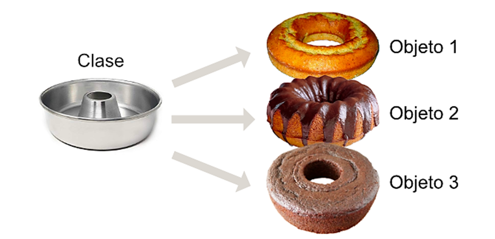

# 🐍 Clase 03 - Clases y Objetos

# Parte 01 - Clases y objetos

## ¿Qué son las clases y los objetos?

> El mundo está orientado a objetos. Está lleno de objetos como Gorrión, Rosa, Guitarra, Teclado, etc.-
> 
- Cada objeto es una instancia específica de una clase. Por ejemplo, el Gorrión es una instancia específica de la clase Pájaro o Rosa es una instancia específica de la clase Flor.
- Pájaro es una clase. Gorrión, Cuervo, Águila son objetos de la clase Pájaro.
- Futbolista es una clase. Messi, Ronaldo, Iniesta son objetos de la clase Futbolista.
- Flor es una clase. Rosas, Tulipanes, Girasoles son objetos de la clase Flor.
- Instrumento musical es una clase: Guitarra, Piano y Flauta son objetos de la clase Instrumento musical.

> Una clase describe dos cosas: la forma que tendrá un objeto creado a partir de ella y la funcionalidad que tendrá. Por ejemplo, la clase Pájaro puede especificar la forma en términos de peso, color, número de plumas, mientras que la funcionalidad nos habla de volar, saltar, comer, entre otros.
> 
- A la 'forma' suele denominarse como **propiedades** y a la funcionalidad: **métodos**. Una clase nos permite agrupar propiedades y funcionalidad juntos.
- Cuando se crean objetos como Gorrión o Águila a partir de la clase Pájaro, las propiedades tendrán valores. Los métodos nos permiten acceder o manipular estos valores. Por ejemplo, la propiedad peso tendrá un valor de 250 gramos para un objeto Gorrión, mientras que para un objeto Águila su peso es de 10 Kg.

> Así pues, una clase es de naturaleza genérica, mientras que un objeto es de naturaleza específica. Se pueden crear múltiples objetos a partir de una clase. El proceso de creación de un objeto a partir de una clase se denomina **instanciación.**
> 




## Clases y Objetos en Python

- En Python cada tipo de dato es una clase. Así, `int`, `float`, `complex`, `bool`, `str`, `list`, `tuple`, `set`, `dict` son todos clases.
- Una clase tiene un nombre, mientras que los objetos no tienen nombre. Como los objetos no tienen nombre, se hace referencia a ellos utilizando sus direcciones en memoria.

---

## Ejemplos programáticos de clases y objetos:

```python
a = 3.14  # a es un objeto de la clase float
s = "Marge"  # s es un objeto de la clase str
lst = [19, 20, 30]  # lst es un objeto de la clase list
tpl = ('a', 'b', 'c')  # tpl es un objeto de la clase tuple

```

- Diferentes objetos de un tipo particular pueden contener diferentes datos, pero los mismos métodos:

```python
s1 = 'Sonia'  # s1 es un objeto de tipo str
s2 = 'Greta'  # s2 es un objeto de tipo str

```

> Aquí s1 y s2 son objetos de la clase **str** que contienen datos diferentes, pero los mismos métodos como upper(), lower(), capitalize(), etc.
> 

---

<aside>


Los datos específicos de un objeto a menudo se denominan **datos de instancia o propiedades** del objeto o estado del objeto o **atributos** del objeto. Los *métodos de un objeto* se denominan **métodos de instancia**.

</aside>

---

## Clases definidas por el usuario

- Además de proporcionar clases prefabricadas como `int`, `str`, `list`, `tuple`, etc., Python nos permite definir nuestras propias clases y crear objetos a partir de ellas.
- Las clases que definimos o creamos se llaman *user-defined data types*. Las reglas para definir y utilizar una clase definida por el usuario y una clase estándar de Python son las mismas.

---

## Definamos una clase que llamaremos Empleado:


```python
class Person:
			Name = ''
			Sexo = ''
			Profesion = ''
			
			def work:
			    print("Aqui van comportamientos")
			    
			def study:
			    print("Aqui van las horas de estudio")
```

```python
class Person:
			Name = ''
			Sexo = ''
			Profesion = ''
			
			def work:
			    print("Aqui van comportamientos")
			    
			def study:
			    print("Aqui van las horas de estudio")

class Empleado:
    def set_data(self, n, e, s):
        self.nombre = n
        self.edad = e
        self.salario = s

    def display_data(self):
        print(self.nombre, self.edad, self.salario)

e1 = Empleado()
e1.set_data('Julian', 23, 25000)
e1.display_data()

e2 = Empleado()
e2.set_data('Thomas', 25, 30000)
e2.display_data()

```

Salida:

```
Julian 23 25000
Thomas 25 30000
```

> La clase Empleado contiene dos métodos `set_data()` y `display_data()` que se utilizan para establecer y mostrar los datos presentes en los objetos creados a partir de la clase Empleado.
> 

> Se crean dos objetos mediante las sentencias:
> 

```python
e1 = Empleado()
e2 = Empleado()
```

- Las direcciones de los objetos  se almacenan en `e1` y `e2`.
- En principio, ambos objetos deberían contener los datos de instancia `nombre`, `edad`, `salario` y los métodos de instancia `set_data()` y `display_data()`.

> En la práctica, cada objeto tiene sus propios datos de instancia: nombre, edad y salario, mientras que los métodos set_data() y display_data() se comparten entre los objetos.
> 

<aside>


> Los datos de instancia no se comparten, ya que los valores de los datos de instancia serían diferentes de un objeto a otro.
> 
</aside>

- La sintaxis para llamar al método de un objeto es `object.method()`, tal como en `e1.set_data()`.
- Dentro de `set_data()`, `self` contiene la dirección del primer objeto. Del mismo modo, cuando `set_data()` es llamado usando `e2`, `self` contiene la dirección del segundo objeto.

## Convenio de acceso.

Hemos accedido a los métodos de instancia `set_data()` y `display_data()` desde fuera de la clase. Incluso los datos de instancia `nombre`, `edad` y `salario` son accesibles desde fuera de la clase. Por lo tanto, las siguientes sentencias funcionarán:

```python
e3 = Empleado()
e3.nombre = 'Ana'
e3.edad = 25
e3.salario = 30000
e3.display_data()
```

Salida:

```
Ana 25 30000
```

<aside>


Sin embargo, es una buena idea mantener los datos de una clase inaccesibles desde fuera de la clase y acceder a ellos sólo a través de funciones miembro de la clase.

</aside>

- No hay ningún mecanismo o palabra clave disponible en Python para hacer cumplir esto. Por lo tanto, se utiliza una convención para iniciar los identificadores de datos de instancia con dos guiones bajos (a menudo llamado `underscore`, abreviatura de double underscore). Ejemplo:  `__nombre`, `__edad` y `__salario`.

---

### 🧪 Ejercicio 1 – Modelando una clase sencilla (similar a `Empleado`)

Crea una clase llamada `Libro` que represente libros de una biblioteca.

1. La clase debe tener un método `set_data(self, titulo, autor, paginas)` que guarde esos datos en atributos de instancia.
2. Debe tener un método `mostrar(self)` que imprima los datos en una sola línea, por ejemplo:
    
    `El Quijote - Miguel de Cervantes - 800 páginas`
    
3. Crea al menos **tres objetos** de la clase `Libro` con datos diferentes y muestra la información de cada uno usando el método `mostrar()`.

### 🧪 Ejercicio 2 – Del mundo real a clases y objetos

Sin escribir código (solo en papel o en comentarios):

1. Elige **tres clases del mundo real**, por ejemplo: `Coche`, `Estudiante`, `Videojuego`.
2. Para cada clase, indica:
    - Al menos **3 posibles objetos** (instancias).
        - Ej.: para `Coche`: *Coche rojo de Ana*, *Taxi 1234-ABC*, *Camión de reparto*.
    - Al menos **3 propiedades (atributos)** que podrían tener esos objetos.
        - Ej.: color, marca, año, matrícula.
    - Al menos **2 métodos (funcionalidades)** que tenga sentido que esos objetos puedan hacer.
        - Ej.: arrancar(), frenar(), acelerar(), mostrar_info().

## Inicialización de objetos:

Hay dos maneras de inicializar un objeto:

<aside>


**inicializar un objeto** significa **crear una instancia con datos iniciales**.

</aside>

- **Método 1**: Usando métodos como `get_data()`/`set_data()`.
    
    <aside>
    
    
    Primero se crea el objeto vacío (por ejemplo: `e = Empleado()`).
    
    Luego se usa un **método** para **cargarle datos**:
    
    `get_data()` → suele pedir los datos por teclado (con `input()`).
    
    `set_data()` → recibe valores como parámetros y los asigna a los atributos.
    
    ```python
    # Ejemplo ilustrativo
    e = Empleado()
    e.set_data('Ana', 25, 30000)
    ```
    
    </aside>
    
- **Método 2**: Usando el método especial `__init__()`.
    
    <aside>
    
    
    `__init__()` es el **constructor** de Python: se ejecuta **automáticamente** cuando se crea el objeto. Recibe parámetros **directamente al crear el objeto**, así que no necesitas llamar a un método aparte.
    
    ```python
    class Empleado:
        def __init__(self, nombre, edad, salario):
            self.nombre = nombre
            self.edad = edad
            self.salario = salario
    
    e = Empleado('Ana', 25, 30000)  # Se inicializa de inmediato
    ```
    
    - El beneficio de inicializar un objeto usando el método especial `__init__()` es que garantiza la inicialización, ya que `__init__()` siempre se llama cuando se crea un objeto.
    - `__init__()` es llamado una sola vez durante toda la vida de un objeto.
    - El método `__del__()` es llamado automáticamente cuando un objeto sale del ámbito. La actividad de limpieza, si la hay, debe hacerse en `__del__()`.
    </aside>
    

## Variables y métodos de clase

### Definición de variable de clase

> Una variable de clase es una variable que se **comparte entre todas las instancias de una clase**. Se define a nivel de clase y no está asociada a un objeto específico, lo que significa que su valor es común para todos los objetos creados a partir de esa clase.
> 
> 
> **Ejemplo simple:**
> 
> ```python
> class Coche:
>     total_coches = 0  # Variable de clase
> 
>     def __init__(self, marca):
>         self.marca = marca  # Variable de instancia
>         Coche.total_coches += 1  # Incrementa la variable de clase
> 
> # Creando instancias
> coche1 = Coche("Toyota")
> coche2 = Coche("Honda")
> 
> # Accediendo a la variable de clase
> print(Coche.total_coches)  # Salida: 2
> 
> ```
> 
> Salida:
> 
> ```
> 2
> ```
> 

### Definición de método de clase

> Un método de clase es una función que pertenece a la clase en su conjunto y no a una instancia específica. Se define utilizando el decorador `@classmethod` y recibe el parámetro `cls` como referencia a la clase, en lugar de `self`.
> 
> 
> **Ejemplo simple:**
> 
> ```python
> class Estudiante:
>     total_estudiantes = 0  # Variable de clase
> 
>     @classmethod
>     def incrementar_contador(cls):
>         cls.total_estudiantes += 1
>         return cls.total_estudiantes
> 
>     @classmethod
>     def obtener_total(cls):
>         return cls.total_estudiantes
> 
> # Usando los métodos de clase
> Estudiante.incrementar_contador()  # Añade 1 estudiante
> Estudiante.incrementar_contador()  # Añade otro estudiante
> 
> print(Estudiante.obtener_total())  # Salida: 2
> 
> ```
> 
> Salida:
> 
> ```
> 2
> ```
> 

### Diferencia con variables/métodos de instancia

<aside>


**Variables de instancia**: Están asociadas a objetos individuales y se declaran con `self`. Cada objeto tiene su propia copia de estas variables.

**Métodos de instancia**: Operan sobre un objeto específico y requieren `self` como primer argumento.

Ejemplo:

```python
class Perro:
    # Variable de clase
    total_perros = 0

    def __init__(self, nombre):
        # Variable de instancia
        self.nombre = nombre
        Perro.total_perros += 1

    # Método de instancia
    def ladrar(self):
        return f"{self.nombre} está ladrando!"

    # Método de clase
    @classmethod
    def contar_perros(cls):
        return f"Total de perros: {cls.total_perros}"

# Creando instancias
perro1 = Perro("Rex")
perro2 = Perro("Luna")

# Accediendo a variables y métodos
print(perro1.nombre)  # Salida: Rex (variable de instancia única por objeto)
print(perro2.nombre)  # Salida: Luna (variable de instancia única por objeto)
print(Perro.total_perros)  # Salida: 2 (variable de clase compartida)
print(perro1.ladrar())  # Salida: Rex está ladrando! (método de instancia)
print(Perro.contar_perros())  # Salida: Total de perros: 2 (método de clase)
```

Salida:

```
Rex
Luna
2
Rex está ladrando!
Total de perros: 2
```

</aside>

## Se puede destacar que:

- Para compartir una variable entre todos los objetos de una clase, se debe declarar como variable de clase o atributo de clase.
- Las variables de clase se declaran sin `self` y no forman parte de los objetos de la clase.
- El acceso a variables de clase se realiza con la sintaxis `classname.varname`.
- Los métodos de clase no reciben el argumento `self`, a diferencia de los métodos de instancia.
- El acceso a métodos de clase se hace con `classname.methodname()`.
- Las variables de clase pueden usarse para contar cuántos objetos se han creado a partir de una clase.

## Funciones `vars()` y `dir()`

Existen dos útiles funciones integradas (built-in) `vars()` y `dir()`. De ellas, `vars()` devuelve un **diccionario de atributos y sus valores,** mientras que `dir()` devuelve una **lista de atributos.**

### Ejemplo aplicado a una clase propia de la librería estandar de Python.

```python
import math # módulo estándar

print("--- Atributos del módulo 'math' (vars) ---")
print("Estos son los atributos y sus valores definidos en el diccionario interno de 'math':")
print(vars(math)) 
print("\n" + "="*50 + "\n") # Separador para mayor claridad

print("--- Lista de atributos y métodos del módulo 'math' (dir) ---")
print("Estos son todos los nombres (atributos y métodos) accesibles en el módulo 'math':")
print(dir(math))
print("\n" + "="*50 + "\n") # Separador final
```

Salida:

```
--- Atributos del módulo 'math' (vars) ---
Estos son los atributos y sus valores definidos en el diccionario interno de 'math':
{'__name__': 'math', '__doc__': 'This module provides access to the mathematical functions\ndefined by the C standard.', '__package__': '', '__loader__': <_frozen_importlib_external.ExtensionFileLoader object at 0x7fd4f30697e0>, '__spec__': ModuleSpec(name='math', loader=<_frozen_importlib_external.ExtensionFileLoader object at 0x7fd4f30697e0>, origin='/usr/local/lib/python3.10/lib-dynload/math.cpython-310-x86_64-linux-gnu.so'), 'acos': <built-in function acos>, 'acosh': <built-in function acosh>, 'asin': <built-in function asin>, 'asinh': <built-in function asinh>, 'atan': <built-in function atan>, 'atan2': <built-in function atan2>, 'atanh': <built-in function atanh>, 'ceil': <built-in function ceil>, 'copysign': <built-in function copysign>, 'cos': <built-in function cos>, 'cosh': <built-in function cosh>, 'degrees': <built-in function degrees>, 'dist': <built-in function dist>, 'erf': <built-in function erf>, 'erfc': <built-in function erfc>, 'exp': <built-in function exp>, 'expm1': <built-in function expm1>, 'fabs': <built-in function fabs>, 'factorial': <built-in function factorial>, 'floor': <built-in function floor>, 'fmod': <built-in function fmod>, 'frexp': <built-in function frexp>, 'fsum': <built-in function fsum>, 'gamma': <built-in function gamma>, 'gcd': <built-in function gcd>, 'hypot': <built-in function hypot>, 'isclose': <built-in function isclose>, 'isfinite': <built-in function isfinite>, 'isinf': <built-in function isinf>, 'isnan': <built-in function isnan>, 'isqrt': <built-in function isqrt>, 'lcm': <built-in function lcm>, 'ldexp': <built-in function ldexp>, 'lgamma': <built-in function lgamma>, 'log': <built-in function log>, 'log1p': <built-in function log1p>, 'log10': <built-in function log10>, 'log2': <built-in function log2>, 'modf': <built-in function modf>, 'pow': <built-in function pow>, 'radians': <built-in function radians>, 'remainder': <built-in function remainder>, 'sin': <built-in function sin>, 'sinh': <built-in function sinh>, 'sqrt': <built-in function sqrt>, 'tan': <built-in function tan>, 'tanh': <built-in function tanh>, 'trunc': <built-in function trunc>, 'prod': <built-in function prod>, 'perm': <built-in function perm>, 'comb': <built-in function comb>, 'nextafter': <built-in function nextafter>, 'ulp': <built-in function ulp>, '__file__': '/usr/local/lib/python3.10/lib-dynload/math.cpython-310-x86_64-linux-gnu.so', 'pi': 3.141592653589793, 'e': 2.718281828459045, 'tau': 6.283185307179586, 'inf': inf, 'nan': nan}

==================================================

--- Lista de atributos y métodos del módulo 'math' (dir) ---
Estos son todos los nombres (atributos y métodos) accesibles en el módulo 'math':
['__doc__', '__file__', '__loader__', '__name__', '__package__', '__spec__', 'acos', 'acosh', 'asin', 'asinh', 'atan', 'atan2', 'atanh', 'ceil', 'comb', 'copysign', 'cos', 'cosh', 'degrees', 'dist', 'e', 'erf', 'erfc', 'exp', 'expm1', 'fabs', 'factorial', 'floor', 'fmod', 'frexp', 'fsum', 'gamma', 'gcd', 'hypot', 'inf', 'isclose', 'isfinite', 'isinf', 'isnan', 'isqrt', 'lcm', 'ldexp', 'lgamma', 'log', 'log10', 'log1p', 'log2', 'modf', 'nan', 'nextafter', 'perm', 'pi', 'pow', 'prod', 'radians', 'remainder', 'sin', 'sinh', 'sqrt', 'tan', 'tanh', 'tau', 'trunc', 'ulp']

==================================================

```

Ejemplo aplicado a una clase creada por un usuario:

```python
class Fruta:
    count = 0

    def __init__(self, nombre='', tamaño=0, color=''):
        self._nombre = nombre
        self._tamaño = tamaño
        self._color = color
        Fruta.count += 1

    def display():
        print(Fruta.count)

f1 = Fruta('Banana', 5, 'Amarillo')
print(vars(Fruta))
print(dir(Fruta))

```

Salida:

```
{'__module__': '__main__', 'count': 1, '__init__': <function Fruta.__init__ at 0x7fd4a1eabd90>, 'display': <function Fruta.display at 0x7fd4a1eabf40>, '__dict__': <attribute '__dict__' of 'Fruta' objects>, '__weakref__': <attribute '__weakref__' of 'Fruta' objects>, '__doc__': None}
['__class__', '__delattr__', '__dict__', '__dir__', '__doc__', '__eq__', '__format__', '__ge__', '__getattribute__', '__gt__', '__hash__', '__init__', '__init_subclass__', '__le__', '__lt__', '__module__', '__ne__', '__new__', '__reduce__', '__reduce_ex__', '__repr__', '__setattr__', '__sizeof__', '__str__', '__subclasshook__', '__weakref__', 'count', 'display']

```

```python
print(vars(f1))
print(dir(f1))
```

Salida:

```
{'_nombre': 'Banana', '_tamaño': 5, '_color': 'Amarillo'}
['__class__', '__delattr__', '__dict__', '__dir__', '__doc__', '__eq__', '__format__', '__ge__', '__getattribute__', '__gt__', '__hash__', '__init__', '__init_subclass__', '__le__', '__lt__', '__module__', '__ne__', '__new__', '__reduce__', '__reduce_ex__', '__repr__', '__setattr__', '__sizeof__', '__str__', '__subclasshook__', '__weakref__', '_color', '_nombre', '_tamaño', 'count', 'display']
```

### Ejercicio 3 – Usando `__init__` para inicializar objetos

Diseña una clase `Alumno` que use un **constructor**:

1. La clase debe tener un método especial `__init__(self, nombre, edad, curso)` que:
    - Guarde estos valores en atributos de instancia (`self.nombre`, `self.edad`, `self.curso`).
2. Crea una lista llamada `alumnos` que contenga **al menos 4 objetos** de tipo `Alumno`.
3. Recorre la lista y muestra los datos de cada alumno en un formato como:
    
    `Nombre: Ana | Edad: 20 | Curso: 1º DAM`
    

### 🧪 Ejercicio 4 – Variables de clase y método de clase (contador de objetos)

Crea una clase `Producto` para una tienda:

1. Define en la clase una **variable de clase** llamada `total_productos` inicializada a 0.
2. En el método `__init__(self, nombre, precio)`:
    - Guarda `nombre` y `precio` como atributos de instancia.
    - Incrementa `Producto.total_productos` cada vez que se crea un objeto.
3. Define un **método de clase** `@classmethod def contar_productos(cls):` que:
    - Devuelva un texto como: `"Total de productos creados: X"`.
4. Crea al menos **5 objetos** de tipo `Producto`.
5. Llama al método de clase `contar_productos()` sin usar ningún objeto (es decir, usando la clase).

### 🧪 Ejercicio 5 – Explorando atributos con `vars()` y `dir()`

Trabaja con una clase propia y las funciones `vars()` y `dir()`:

1. Crea una clase `Animal` con:
    - Una variable de clase `es_ser_vivo = True`.
    - Un constructor `__init__(self, especie, edad)` que guarde esos valores en atributos de instancia.
    - Un método `descripcion(self)` que devuelva un texto como:
        
        `"Soy un perro de 5 años"`.
        
2. Crea un objeto `a1 = Animal("perro", 5)`.
3. Utiliza en tu código:
    - `print(vars(Animal))`
    - `print(dir(Animal))`
    - `print(vars(a1))`
    - `print(dir(a1))`
4. Responde (en comentarios o en un documento aparte):
    - ¿Qué ves en el diccionario devuelto por `vars(Animal)`?
    - ¿Qué diferencia notas entre `vars(Animal)` y `vars(a1)`?
    - ¿Qué tipo de nombres aparecen en la lista de `dir(a1)` además de tus atributos y métodos?