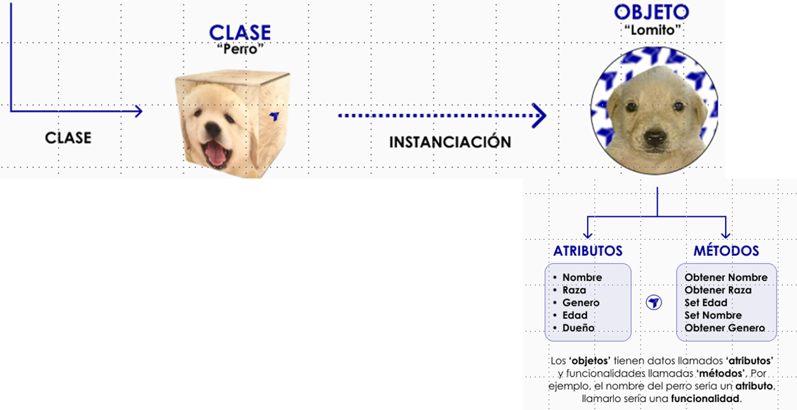

# 🐍 Clase 04 - Métodos y Encapsulación

# Parte 01 - Atributos y métodos

## Ejemplo comparativo:

> Supongamos que nos piden crear un registro para manejar los clientes de una empresa con su nombre sus apellidos y su DNI. El programa debe permitirnos mostrar los datos de los clientes o borrarlos. Usando la programación estructurada el código se vería así:
> 

```python
# Definimos unos cuantos clientes
clientes = [
    {'Nombre': 'Hector', 'Apellidos': 'Costa Guzmán', 'dni': '11111111A'},
    {'Nombre': 'Juan', 'Apellidos': 'González Márquez', 'dni': '22222222B'}
]
```

Creamos una función que muestra un cliente en una lista a partir del DNI:

```python
def mostrar_cliente(clientes, dni):
    for c in clientes:
        if (dni == c['dni']):
            print('{} {}'.format(c['Nombre'], c['Apellidos']))
            return
    print('Cliente no encontrado')
```

Creamos una función que borra un cliente en una lista a partir del DNI

```python
def borrar_cliente(clientes, dni):
    for i, c in enumerate(clientes):
        if (dni == c['dni']):
            del(clientes[i])
            print(str(c), "> BORRADO")
            return
    print('Cliente no encontrado')
```

Fíjate muy bien cómo se utiliza el código estructurado:

```python
print("==LISTADO DE CLIENTES==")
print(clientes)

print("\n==MOSTRAR CLIENTES POR DNI==")
mostrar_cliente(clientes, '11111111A')
mostrar_cliente(clientes, '11111111Z')

print("\n==BORRAR CLIENTES POR DNI==")
borrar_cliente(clientes, '22222222V')
borrar_cliente(clientes, '22222222B')

print("\n==LISTADO DE CLIENTES==")
print(clientes)
```

Salida:

```
==LISTADO DE CLIENTES==
[{'Nombre': 'Hector', 'Apellidos': 'Costa Guzmán', 'dni': '11111111A'}, {'Nombre': 'Juan', 'Apellidos': 'González Márquez', 'dni': '22222222B'}]

==MOSTRAR CLIENTES POR DNI==
Hector Costa Guzmán
Cliente no encontrado

==BORRAR CLIENTES POR DNI==
Cliente no encontrado
{'Nombre': 'Juan', 'Apellidos': 'González Márquez', 'dni': '22222222B'} > BORRADO

==LISTADO DE CLIENTES==
[{'Nombre': 'Hector', 'Apellidos': 'Costa Guzmán', 'dni': '11111111A'}]

```

Mientras que, el mismo ejercicio, pero utilizando POO sería así:

Creo una estructura para los clientes

```python
class Cliente:
    def __init__(self, dni, nombre, apellidos):
        self.dni = dni
        self.nombre = nombre
        self.apellidos = apellidos

    def __str__(self):
        return '{} {}'.format(self.nombre, self.apellidos)
```

Y otra para las empresas

```python
class Empresa:
    def __init__(self, clientes=[]):
        self.clientes = clientes

    def mostrar_cliente(self, dni=None):
        for c in self.clientes:
            if c.dni == dni:
                print(c)
                return
        print("Cliente no encontrado")

    def borrar_cliente(self, dni=None):
        for i, c in enumerate(self.clientes):
            if c.dni == dni:
                del(self.clientes[i])
                print(str(c), "> BORRADO")
                return
        print("Cliente no encontrado")
```

Ahora utilizaremos ambas estructuras

```python
# Creo un par de clientes
hector = Cliente(nombre="Hector", apellidos="Costa Guzman", dni="11111111A")
juan = Cliente("22222222B", "Juan", "Gonzalez Marquez")

# Creo una empresa con los clientes iniciales
empresa = Empresa(clientes=[hector, juan])

# Muestro todos los clientes
print("==LISTADO DE CLIENTES==")
print(empresa.clientes)

print("\\n==MOSTRAR CLIENTES POR DNI==")
# Consulto clientes por DNI
empresa.mostrar_cliente("11111111A")
empresa.mostrar_cliente("11111111Z")

print("\\n==BORRAR CLIENTES POR DNI==")
# Borro un cliente por DNI
empresa.borrar_cliente("22222222V")
empresa.borrar_cliente("22222222B")

# Muestro de nuevo todos los clientes
print("\\n==LISTADO DE CLIENTES==")
print(empresa.clientes)
```

Salida:

```
==LISTADO DE CLIENTES==
[<__main__.Cliente object at 0x7f912f566a40>, <__main__.Cliente object at 0x7f912f564400>]
\n==MOSTRAR CLIENTES POR DNI==
Hector Costa Guzman
Cliente no encontrado
\n==BORRAR CLIENTES POR DNI==
Cliente no encontrado
Juan Gonzalez Marquez > BORRADO
\n==LISTADO DE CLIENTES==
[<__main__.Cliente object at 0x7f912f566a40>]

```

<aside>

### ✅ Ejercicio de refuerzo 1

Se te proporciona el siguiente código estructurado que gestiona los vehículos de un taller mecánico. Tu tarea es **convertirlo a Programación Orientada a Objetos (POO)**. 

Código Estructurado (Punto de Partida): 

```python
# Definimos unos cuantos vehículos
vehiculos = [
    {'Marca': 'Toyota', 'Modelo': 'Corolla', 'matricula': '1234ABC'},
    {'Marca': 'Ford', 'Modelo': 'Focus', 'matricula': '5678DEF'},
    {'Marca': 'Seat', 'Modelo': 'Ibiza', 'matricula': '9012GHI'}
]
```

```python
def buscar_vehiculo(vehiculos, matricula):
    for v in vehiculos:
        if (matricula == v['matricula']):
            print('{} {} ({})'.format(v['Marca'], v['Modelo'], v['matricula']))
            return
    print('Vehículo no encontrado')

def eliminar_vehiculo(vehiculos, matricula):
    for i, v in enumerate(vehiculos):
        if (matricula == v['matricula']):
            del vehiculos[i]
            print(str(v), "> ELIMINADO")
            return
    print('Vehículo no encontrado')
```

```python
print("==LISTADO DE VEHÍCULOS==")
print(vehiculos)
print("\n==BUSCAR VEHÍCULOS POR MATRÍCULA==")
buscar_vehiculo(vehiculos, '1234ABC')
buscar_vehiculo(vehiculos, '0000XXX')
print("\n==ELIMINAR VEHÍCULOS POR MATRÍCULA==")
eliminar_vehiculo(vehiculos, '9999ZZZ')
eliminar_vehiculo(vehiculos, '5678DEF')
print("\n==LISTADO DE VEHÍCULOS==")
print(vehiculos)
```

Transforma el código anterior utilizando **Programación Orientada a Objetos**. Debes crear:

1. **Clase `Vehiculo`**: Representa un vehículo individual con sus atributos (marca, modelo, matrícula) y un método `__str__` para mostrar su información.
2. **Clase `Taller`**: Representa el taller que contiene una lista de vehículos. Debe incluir los métodos:
    - `buscar_vehiculo(matricula)`: Busca y muestra un vehículo por su matrícula.
    - `eliminar_vehiculo(matricula)`: Elimina un vehículo de la lista por su matrícula.
3. **Código principal**: Crea instancias de vehículos, un taller, y realiza las mismas operaciones que el código estructurado.

Salida esperada

```python
==LISTADO DE VEHÍCULOS==
[<__main__.Vehiculo object at 0x...>, <__main__.Vehiculo object at 0x...>, <__main__.Vehiculo object at 0x...>]

==BUSCAR VEHÍCULOS POR MATRÍCULA==
Toyota Corolla (1234ABC)
Vehículo no encontrado

==ELIMINAR VEHÍCULOS POR MATRÍCULA==
Vehículo no encontrado
Ford Focus (5678DEF) > ELIMINADO

==LISTADO DE VEHÍCULOS==
[<__main__.Vehiculo object at 0x...>, <__main__.Vehiculo object at 0x...>]
```

</aside>

# Atributos y métodos - Diferencias

Los objetos se crean a partir de una plantilla llamada clase. Cada objeto es una instancia de su clase.



En POO, definir variables y funciones dentro de las clases, se conocen como **atributos** y **métodos** respectivamente.

## Atributos

A efectos prácticos los atributos no son muy distintos de las variables, la diferencia fundamental es que sólo existen dentro del objeto.

## Atributos dinámicos

Dado que Python es muy flexible los atributos pueden manejarse de distintas formas, por ejemplo se pueden crear dinámicamente (al vuelo) en los objetos.

```python
class Galleta:
    pass

galleta = Galleta()
galleta.sabor = "salado"
galleta.color = "marrón"

print(f"El sabor de esta galleta es {galleta.sabor} "
      f"y el color {galleta.color}")
```

Salida:

```
El sabor de esta galleta es salado y el color marrón
```

### Atributos de clase

Aunque la flexibilidad de los atributos dinámicos puede llegar a ser muy útil, tener que definir los atributos de esa forma es tedioso. Es **más práctico definir unos atributos básicos en la clase.** De esa manera todas las galletas podrían tener unos atributos por defecto:

```python
class Galleta:
    chocolate = False  # Atributo de clase (compartido por todas las instancias)

galleta = Galleta()

if galleta.chocolate:
    print("La galleta tiene chocolate")
else:
    print("La galleta no tiene chocolate")
```

## Métodos

Si por un lado tenemos las "variables" (atributos) de las clases, por otro tenemos sus "funciones" (métodos), que nos permiten definir funcionalidades para llamarlas desde las instancias. Definir un método es simple: se añade en la clase y se llama desde el objeto con paréntesis, como una función.

## Ejemplo con error común

```python
class Galleta:
    chocolate = False

def saludar():
	print("Hola, soy una galleta muy sabrosa")

galleta = Galleta()
galleta.saludar()  # Esto generará un error
```

Salida:

```
Execution error

AttributeError: 'Galleta' object has no attribute 'saludar'
```

> El error nos indica que el método saludar() no forma parte de la clase.
> 
1. El método **`saludar()`** está definido **fuera** de la clase (no indentado correctamente).
2. Al no estar dentro de la clase y no aceptar parámetros, falla

De modo que:

```python
class Galleta:
    chocolate = False
    
    def saludar():  # Correctamente indentado dentro de la clase
        print("Hola, soy una galleta muy sabrosa")

Galleta.saludar()
```

Salida:

```
Hola, soy una galleta muy sabrosa
```

### Métodos especiales

Se llaman especiales porque la mayoría ya existen de forma oculta y sirven para tareas específicas.

### Constructor: `__init__`

El constructor es un método que se llama automáticamente al crear un objeto. Se define con el nombre `__init__`:

```python
class Galleta:
    def __init__(self):
        print("Soy una galleta acabada de hornear!")

galleta = Galleta()  # Al instanciar, se ejecuta automáticamente __init__
```

Salida:

```
Soy una galleta acabada de hornear!
```

La finalidad del constructor es construir los objetos, permitiendo enviar datos iniciales para su configuración:

```python
nombre_1 = "Pedro" # Esto no es un atributo es una variable

class Galleta:
    chocolate = False  # Atributo de clase

    def __init__(self, sabor, color):
        self.sabor = sabor  # Atributo de instancia
        self.color = color  # Atributo de instancia
        print(f"Se acaba de crear una galleta {self.color} y {self.sabor}.")

# Creación de instancias
galleta_1 = Galleta("marrón", "amarga")
galleta_2 = Galleta("blanca", "dulce")
```

Salida:

```
Se acaba de crear una galleta amarga y marrón.
Se acaba de crear una galleta dulce y blanca.
```

## Objetos dentro de objetos

Las clases pueden utilizarse como cualquier otro tipo de dato, permitiendo su almacenamiento en colecciones y su uso como atributos en otras clases. Este ejemplo muestra un catálogo de películas:

```python
class Pelicula:
    def __init__(self, titulo, duracion, lanzamiento):
        self.titulo = titulo
        self.duracion = duracion
        self.lanzamiento = lanzamiento
        print(f'Se ha creado la película: {self.titulo}')

    def __str__(self):
        return f'{self.titulo} ({self.lanzamiento})'
```

```python
class Catalogo:
    peliculas = []  # Variable de clase (compartida)

    def __init__(self, peliculas=[]):
        self.peliculas = peliculas  # Variable de instancia

    def agregar(self, p):  # 'p' es un objeto Película
        self.peliculas.append(p)

    def mostrar(self):
        for p in self.peliculas:
            print(p)  # Usa automáticamente __str__ de Película
```

Implementación:

```python
# Creación de películas
p1 = Pelicula("El Padrino", 175, 1972)
p2 = Pelicula("El Padrino: Parte 2", 202, 1974)

# Creación de catálogo
c = Catalogo([p1])  # Inicializado con una película
c.agregar(p2)       # Añadiendo segunda película
c.mostrar()
```

Salida:

```
Se ha creado la película: El Padrino
Se ha creado la película: El Padrino: Parte 2
El Padrino (1972)
El Padrino: Parte 2 (1974)
```

<aside>

## ✅ Ejercicio de refuerzo 2

**Parte 1: Atributos Dinámicos**

---

Dada la siguiente clase vacía, crea una instancia y añade dinámicamente los atributos `titulo` y `artista`. Luego imprime un mensaje con esa información.

```python
class Cancion:
    pass
```

**Salida esperada:**

```
La canción Bohemian Rhapsody es interpretada por Queen
```

---

**Parte 2: Atributos de Clase**

Modifica la clase `Cancion` para que tenga un atributo de clase llamado `reproducida` con valor `False`. Crea una instancia y verifica si la canción ha sido reproducida.

**Salida esperada:**

```
La canción no ha sido reproducida todavía
```

---

**Parte 3: Identificar el Error**

El siguiente código tiene un error común. Identifícalo y explica por qué falla:

```python
class Cancion:
    reproducida = False

def reproducir():
    print("♪ Reproduciendo canción... ♪")

cancion = Cancion()
cancion.reproducir()

```

**Salida (error):**

```
AttributeError: 'Cancion' object has no attribute 'reproducir'

```

**Pregunta:** ¿Cuál es el problema y cómo lo solucionarías?

---

**Parte 4: Constructor `__init__`**

Crea la clase `Cancion` con un constructor que reciba `titulo`, `artista` y `duracion` (en segundos). Al crear cada instancia, debe imprimir un mensaje de confirmación.

**Código de prueba:**

```python
cancion_1 = Cancion("Imagine", "John Lennon", 183)
cancion_2 = Cancion("Billie Jean", "Michael Jackson", 294)

```

**Salida esperada:**

```
Se ha añadido la canción: Imagine de John Lennon
Se ha añadido la canción: Billie Jean de Michael Jackson

```

---

**Parte 5: Método `__str__`**

Añade el método especial `__str__` a la clase `Cancion` para que al imprimir una instancia muestre el título y la duración en formato `mm:ss`.

**Código de prueba:**

```python
cancion = Cancion("Hotel California", "Eagles", 391)
print(cancion)

```

**Salida esperada:**

```
Se ha añadido la canción: Hotel California de Eagles
Hotel California (6:31)
```

---

**Parte 6: Objetos dentro de Objetos**

Crea una clase `Playlist` que contenga una lista de objetos `Cancion`. La clase debe tener:

- Un constructor que reciba opcionalmente una lista inicial de canciones
- Un método `agregar(cancion)` para añadir canciones
- Un método `mostrar()` para listar todas las canciones
- Un método `duracion_total()` que retorne la duración total en formato `mm:ss`

**Código de prueba:**

```python
# Creación de canciones
c1 = Cancion("Stairway to Heaven", "Led Zeppelin", 482)
c2 = Cancion("Comfortably Numb", "Pink Floyd", 382)
c3 = Cancion("November Rain", "Guns N' Roses", 537)

# Creación de playlist
mi_playlist = Playlist("Rock Clásico", [c1])
mi_playlist.agregar(c2)
mi_playlist.agregar(c3)

# Mostrar playlist
print("\n==PLAYLIST: Rock Clásico==")
mi_playlist.mostrar()
print(f"\nDuración total: {mi_playlist.duracion_total()}")

```

**Salida esperada:**

```
Se ha añadido la canción: Stairway to Heaven de Led Zeppelin
Se ha añadido la canción: Comfortably Numb de Pink Floyd
Se ha añadido la canción: November Rain de Guns N' Roses

==PLAYLIST: Rock Clásico==
Stairway to Heaven (8:02)
Comfortably Numb (6:22)
November Rain (8:57)

Duración total: 23:21
```

---

## Pistas

- Para convertir segundos a formato `mm:ss`, puedes usar división entera (`//`) y módulo (`%`).
- Recuerda que `self` es obligatorio como primer parámetro en los métodos de instancia.
- El método `__str__` debe retornar una cadena, no imprimirla directamente.
- Al agregar canciones a la playlist, trabaja sobre `self.canciones`, no sobre el atributo de clase.
</aside>

# Parte 02 - Encapsulación en Python

Python simula la encapsulación usando doble guion bajo `__` para atributos y métodos "privados".

## Atributos Privados

```python
class Ejemplo:
    __atributo_privado = "Soy inalcanzable desde fuera"

e = Ejemplo()
print(e.__atributo_privado)  # Generará error
```

Salida:

```
AttributeError: 'Ejemplo' object has no attribute '__atributo_privado'
```

## **Métodos Privados**

```python
class Ejemplo:
    def __metodo_privado(self):
        print("Soy inalcanzable desde fuera")

e = Ejemplo()
e.__metodo_privado()  # Generará error
```

Salida:

```
AttributeError: 'Ejemplo' object has no attribute '__metodo_privado'
```

Para poder acceder a esos datos se deberían crear métodos públicos.

```python
class Ejemplo:
    __atributo_privado = "Soy un atributo inalcanzable desde fuera."

    def __metodo_privado(self):
        print("Soy un método inalcanzable desde fuera.")

    # Métodos públicos para acceso controlado
    def atributo_publico(self):
        return self.__atributo_privado

    def metodo_publico(self):
        return self.__metodo_privado()

# Uso correcto
e = Ejemplo()
print(e.atributo_publico())  # Acceso seguro al atributo
e.metodo_publico()          # Ejecución controlada del método
```

Salida:

```
Soy un atributo inalcanzable desde fuera.
Soy un método inalcanzable desde fuera.
```

### Un segundo ejemplo:

```python
class Dispositivo:
    '''Clase dispositivo para objetos conectados a la red'''
    def __init__(self, IP):
        '''Constructor'''
        # Atributo con valor definido al crear el objeto
        self.IP = IP
        # Atributo privado con valor por defecto
        self.__encendido = False

    def __del__(self):
        '''Destructor'''
        print('Destruyendo el dispositivo en ', self.IP)

    def encender(self):
        '''Enciende el dispositivo'''
        self.__encendido = True

    def apagar(self):
        '''Apagar el dispositivo'''
        self.__encendido = False

    def estado(self):
        '''Genera una cadena con el estado actual del dispositivo'''
        mensaje = f'IP: {self.IP}\n'
        if self.__encendido:
            mensaje += 'Estado: Encendido'
        else:
            mensaje += 'Estado: Apagado'
        return mensaje
```

Si intentamos acceder al atributo `__encendido` desde un objeto, Python generará un error:

```python
tv = Dispositivo('23.2.1.4')
tv.__encendido
```

**Salida:**

```python
Execution Error
AttributeError: 'Dispositivo' object has no attribute '__encendido'
```

Todos aquellos métodos y atributos precedidos por doble guion bajo son privados, el resto son públicos y sí son accesibles:

```python
tv.IP
```

**Salida:**

```python
'23.2.1.4'
```

El atributo `__encendido` queda encerrado dentro del objeto y solo puede ser modificado a través de sus métodos. Esto permite controlar en todo momento los valores que puede tomar.

Supongamos ahora una clase televisión que podría tener un atributo interno `__canal` de tipo entero y con rango de valor entre 0 y 54, por ejemplo. Con nuestro mando a distancia podemos pasar al canal siguiente o al anterior, y con el teclado numérico indicar directamente un número de canal.

```python
class Televisor():
    def __init__(self):
        self.__canal = 0 # Atributo privado
        self.__num_canales = 55 # Atributo privado

    def __ajusta_canal(self, canal):
        self.__canal = canal % self.__num_canales

    def siguiente_canal(self):
        self.__ajusta_canal(self.__canal + 1)

    def anterior_canal(self):
        self.__ajusta_canal(self.__canal - 1)

    def cambiar_canal(self, canal):
        if canal > self.__num_canales:
            self.__canal = self.__num_canales - 1
        elif canal < 0:
            self.__canal = 0
        else:
            self.__canal = canal

    def canal_actual(self):
        return self.__canal
```

Aquí tenemos dos atributos privados, `__canal` y `__num_canales`, y un método privado, `__ajusta_canal()` que gracias al uso del operador módulo '%' permite que al subir o bajar de canal nos mantengamos en un ciclo de 0 a 54, es decir, el siguiente canal al 54 es el cero y el anterior al 0 es el 54. Si ejecutamos este código, ya podemos usar nuestro televisor:

```python
tv = Televisor()
```

```python
tv.canal_actual()
```

Salida:

```python
0
```

```python
tv.anterior_canal()
```

```python
tv.canal_actual()
```

Salida:

```python
54
```

```python
tv.cambiar_canal(8)
tv.canal_actual()
```

Salida:

```python
8
```

```python
tv.siguiente_canal()
tv.canal_actual()
```

Salida:

```python
9
```

```python
tv.cambiar_canal(94)
tv.canal_actual()
```

Salida:

```python
54
```

<aside>


## ✅ Ejercicio de refuerzo 3

Desarrolla un **juego de consola en Python** que permita gestionar un escuadrón militar.

Cada soldado tendrá atributos básicos (**nombre**, **fuerza**, **rango**, **años de servicio**, **méritos**) y atributos específicos según su **fuerza**:

| Fuerza | Atributos Específicos |
| --- | --- |
| Tierra | Arma principal, Tanque, Vehículo blindado |
| Aire | Horas de vuelo, Avión asignado, Dron |
| Mar | Embarcación, Vehículo anfibio, Submarino |
| Infantería | Especialidad, Arma ligera, Equipo de combate |
| Artillería | Tipo de artillería, Calibre, Alcance máximo |

El juego debe permitir:

- Crear soldados ingresando todos sus datos y atributos únicos.

- Mostrar el listado completo del escuadrón con todos los detalles.

- Ascender soldados de rango, verificando **años de servicio** y **méritos**.
- Validar entradas numéricas para evitar errores.

### Solución para revisar, probar y mejorar:

```python
class Soldado:
    rangos = [
        "Soldado", "Cabo", "Sargento", "Teniente",
        "Capitán", "Mayor", "Coronel", "General"
    ]
    requisitos = {
        "Soldado": {"anios": 1, "meritos": 0},
        "Cabo": {"anios": 3, "meritos": 2},
        "Sargento": {"anios": 5, "meritos": 3},
        "Teniente": {"anios": 8, "meritos": 5},
        "Capitán": {"anios": 10, "meritos": 6},
        "Mayor": {"anios": 12, "meritos": 8},
        "Coronel": {"anios": 15, "meritos": 10}
    }

    def __init__(self, nombre, fuerza, rango="Soldado", anios_servicio=0, meritos=0, atributos_extra=None):
        self.nombre = nombre
        self.fuerza = fuerza
        self.rango = rango
        self.anios_servicio = anios_servicio
        self.meritos = meritos
        self.atributos_extra = atributos_extra if atributos_extra else {}

    def __str__(self):
        info_base = (f"{self.rango} {self.nombre} | Fuerza: {self.fuerza} | "
                     f"Años: {self.anios_servicio} | Méritos: {self.meritos}")
        if self.atributos_extra:
            extras = " | " + " | ".join([f"{k}: {v}" for k, v in self.atributos_extra.items()])
            return info_base + extras
        else:
            return info_base

    def ascender(self):
        if self.rango == "General":
            print(f"✅ {self.nombre} ya tiene el rango máximo: General.")
            return

        idx_actual = self.rangos.index(self.rango)
        siguiente_rango = self.rangos[idx_actual + 1]
        requisitos = self.requisitos[self.rango]

        if self.anios_servicio >= requisitos["anios"] and self.meritos >= requisitos["meritos"]:
            self.rango = siguiente_rango
            print(f"🎖️ ¡{self.nombre} ha ascendido a {self.rango} ({self.fuerza})!")
        else:
            print(f"⛔ {self.nombre} no cumple requisitos para {siguiente_rango}: "
                  f"{requisitos['anios']} años y {requisitos['meritos']} méritos.")

class Escuadron:
    def __init__(self):
        self.soldados = []

    def agregar_soldado(self, soldado):
        self.soldados.append(soldado)
        print(f"✅ {soldado.nombre} agregado al escuadrón.")

    def mostrar_soldados(self):
        if not self.soldados:
            print("📋 No hay soldados en el escuadrón.")
            return
        print("\n📋 Escuadrón Actual:")
        for s in self.soldados:
            print(f" - {s}")

    def ascender_soldado(self, nombre):
        for s in self.soldados:
            if s.nombre == nombre:
                s.ascender()
                return
        print(f"❌ Soldado {nombre} no encontrado.")

# ================================
# 🎮 Lógica del juego interactivo
# ================================
escuadron = Escuadron()

def crear_soldado():
    nombre = input("Nombre del soldado: ")
    fuerza = input("Fuerza (Tierra, Aire, Mar, Infantería, Artillería): ")

    try:
        anios = int(input("Años de servicio: "))
        meritos = int(input("Número de méritos: "))
    except ValueError:
        print("❌ Entrada inválida: ingrese números enteros para años y méritos.")
        return

    atributos_extra = {}
    if fuerza.lower() == "tierra":
        arma = input("Arma principal: ")
        tanque = input("Tanque asignado: ")
        vehiculo = input("Vehículo blindado: ")
        atributos_extra = {
            "Arma Principal": arma,
            "Tanque": tanque,
            "Vehículo Blindado": vehiculo
        }
    elif fuerza.lower() == "aire":
        horas = input("Horas de vuelo: ")
        avion = input("Avión asignado: ")
        dron = input("Modelo de dron: ")
        atributos_extra = {
            "Horas Vuelo": horas,
            "Avión": avion,
            "Dron": dron
        }
    elif fuerza.lower() == "mar":
        embarcacion = input("Embarcación asignada: ")
        anfibio = input("Vehículo anfibio: ")
        submarino = input("Submarino (sí/no): ")
        atributos_extra = {
            "Embarcación": embarcacion,
            "Anfibio": anfibio,
            "Submarino": submarino
        }
    elif fuerza.lower() == "infantería":
        especialidad = input("Especialidad: ")
        arma = input("Arma ligera: ")
        equipo = input("Equipo de combate: ")
        atributos_extra = {
            "Especialidad": especialidad,
            "Arma Ligera": arma,
            "Equipo": equipo
        }
    elif fuerza.lower() == "artillería":
        tipo = input("Tipo de artillería: ")
        calibre = input("Calibre: ")
        alcance = input("Alcance máximo: ")
        atributos_extra = {
            "Tipo Artillería": tipo,
            "Calibre": calibre,
            "Alcance": alcance
        }
    else:
        print("⚠️ Fuerza no reconocida, se creará con atributos básicos.")

    soldado = Soldado(
        nombre=nombre,
        fuerza=fuerza.capitalize(),
        anios_servicio=anios,
        meritos=meritos,
        atributos_extra=atributos_extra
    )
    escuadron.agregar_soldado(soldado)

# 🎮 Menú principal
while True:
    print("\n🎮 === MENÚ DEL JUEGO MILITAR AVANZADO ===")
    print("1️⃣  Crear soldado")
    print("2️⃣  Ver escuadrón")
    print("3️⃣  Ascender soldado")
    print("4️⃣  Salir")
    opcion = input("Elige una opción: ")

    if opcion == "1":
        crear_soldado()
    elif opcion == "2":
        escuadron.mostrar_soldados()
    elif opcion == "3":
        nombre = input("Nombre del soldado a ascender: ")
        escuadron.ascender_soldado(nombre)
    elif opcion == "4":
        print("👋 Saliendo del juego. ¡Buen trabajo, comandante!")
        break
    else:
        print("❌ Opción no válida. Intenta de nuevo.")

```

</aside>