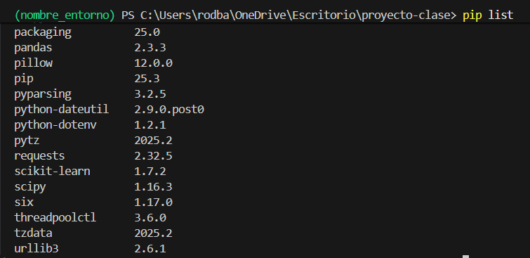

# 🐍 Clase 10 - Crear Entornos de Python desde requirements.txt

## 1️⃣ Fundamentos: ¿Qué es un Entorno Virtual?

### El Problema

Imagina que tienes dos proyectos:

- **Proyecto A**: Necesita `pandas==1.5.0`
- **Proyecto B**: Necesita `pandas==2.0.0`

Si instalas ambas versiones en tu sistema global, una sobrescribirá a la otra. Esto genera conflictos de dependencias que pueden romper tus proyectos.

### La Solución

Un **entorno virtual** es una carpeta aislada que contiene:

- Una copia del intérprete de Python
- Su propio conjunto de paquetes instalados
- Scripts de activación/desactivación

Cada proyecto puede tener su propio entorno con sus propias versiones de librerías, sin interferir con otros proyectos.

### Analogía

Piensa en los entornos virtuales como **cajas de herramientas independientes**. Cada caja tiene exactamente las herramientas que necesitas para un trabajo específico, sin mezclar martillos de carpintería con instrumentos de precisión.

---

## 2️⃣ ¿Qué es `requirements.txt`?

### Definición

Es un archivo de texto plano que lista todas las dependencias de un proyecto Python, incluyendo sus versiones específicas.

### Ejemplo de contenido

```
numpy==1.24.3
pandas==2.0.1
scikit-learn==1.2.2
matplotlib==3.7.1
requests>=2.28.0
python-dotenv~=1.0.0

```

### Operadores de versión

| Operador | Significado | Ejemplo |
| --- | --- | --- |
| `==` | Versión exacta | `pandas==2.0.1` |
| `>=` | Mayor o igual | `requests>=2.28.0` |
| `<=` | Menor o igual | `numpy<=1.25.0` |
| `~=` | Compatible (mismo major/minor) | `flask~=2.3.0` |
| `!=` | Excluir versión | `django!=4.0.0` |
| Sin operador | Última versión disponible | `beautifulsoup4` |

---

## 3️⃣ Paso a Paso: Crear un Entorno Virtual

### Paso 3.1 — Abrir PowerShell

Tienes varias opciones:

- Presiona `Win + X` y selecciona "Windows PowerShell"
- Busca "PowerShell" en el menú inicio
- Click derecho en una carpeta mientras presionas `Shift` → "Abrir ventana de PowerShell aquí"

Navega hasta la carpeta de tu proyecto:

```powershell
cd C:\ruta\a\tu\proyecto

```

### Paso 3.2 — Crear el Entorno Virtual

Usa el módulo `venv` incluido en Python 3.3+:

```powershell
python -m venv nombre_entorno

```

**Ejemplo práctico:**

```powershell
python -m venv venv
```

> El segundo `venv` es el nombre que quiero darle a mi entorno
> 

Esto crea una carpeta `venv\` con la siguiente estructura:

```
venv\
├── Include\        # Headers de C
├── Lib\            # Paquetes instalados
├── Scripts\        # Scripts y ejecutables
│   ├── Activate.ps1
│   ├── python.exe
│   └── pip.exe
└── pyvenv.cfg      # Configuración del entorno
```

### Paso 3.3 — Activar el Entorno

```powershell
.\venv\Scripts\Activate.ps1
```

> Aquí `venv` es el nombre del entorno
> 

**¿Cómo saber si está activado?**

Verás el nombre del entorno al inicio del prompt:

```
(venv) PS C:\Users\tu_usuario\proyecto>
```

### Paso 3.4 — Verificar la Activación

```powershell
# Ver qué Python está activo
Get-Command python

# Ver versión de pip
pip --version
```

El comando debería mostrar la ruta dentro de tu carpeta `venv\Scripts\`.

### Paso 3.5 — Instalación de librerías específicas si no tenemos `requirements.txt`

Supongamos que necesitamos instalar estas librerias:

```
numpy
pandas
matplotlib
scikit-learn
requests
python-dotenv
```

Por ahora, solo por practicar instalaremos uno por uno:

```
pip install numpy
```

```
pip install pandas
```

```
pip install matplotlib
```

```
pip install scikit-learn
```

```
pip install requests
```

```
pip install python-dotenv
```

Ahora escribimos `pip list`:

```
pip list
```



Si queremos inspeccionar alguna librería específica podemos escribir:

```
pip show pandas
```

```
Name: pandas
Version: 2.3.3
Summary: Powerful data structures for data analysis, time series, and statistics
Home-page: https://pandas.pydata.org
Author:
Author-email: The Pandas Development Team <pandas-dev@python.org>
License: BSD 3-Clause License

 Copyright (c) 2008-2011, AQR Capital Management, LLC, Lambda Foundry, Inc. and PyData Development Team
 All rights reserved.

 Copyright (c) 2011-2023, Open source contributors.

 Redistribution and use in source and binary forms, with or without
 modification, are permitted provided that the following conditions are met:

 * Redistributions of source code must retain the above copyright notice, this
   list of conditions and the following disclaimer.

 * Redistributions in binary form must reproduce the above copyright notice,
   this list of conditions and the following disclaimer in the documentation
   and/or other materials provided with the distribution.

 * Neither the name of the copyright holder nor the names of its
   contributors may be used to endorse or promote products derived from
   this software without specific prior written permission.

 THIS SOFTWARE IS PROVIDED BY THE COPYRIGHT HOLDERS AND CONTRIBUTORS "AS IS"
 AND ANY EXPRESS OR IMPLIED WARRANTIES, INCLUDING, BUT NOT LIMITED TO, THE
 IMPLIED WARRANTIES OF MERCHANTABILITY AND FITNESS FOR A PARTICULAR PURPOSE ARE
 DISCLAIMED. IN NO EVENT SHALL THE COPYRIGHT HOLDER OR CONTRIBUTORS BE LIABLE
 FOR ANY DIRECT, INDIRECT, INCIDENTAL, SPECIAL, EXEMPLARY, OR CONSEQUENTIAL
 DAMAGES (INCLUDING, BUT NOT LIMITED TO, PROCUREMENT OF SUBSTITUTE GOODS OR
 SERVICES; LOSS OF USE, DATA, OR PROFITS; OR BUSINESS INTERRUPTION) HOWEVER
 CAUSED AND ON ANY THEORY OF LIABILITY, WHETHER IN CONTRACT, STRICT LIABILITY,
 OR TORT (INCLUDING NEGLIGENCE OR OTHERWISE) ARISING IN ANY WAY OUT OF THE USE
 OF THIS SOFTWARE, EVEN IF ADVISED OF THE POSSIBILITY OF SUCH DAMAGE.

Location: C:\Users\rodba\OneDrive\Escritorio\proyecto-clase\nombre_entorno\Lib\site-packages
Requires: numpy, python-dateutil, pytz, tzdata
Required-by:
```

Supongamos que hemos terminado de instalar las librerías de mi proyecto. Procedemos a desarrollar el código respectivo. Por simplicidad vamos a crear un archivo llamado `main.py`:

 `main.py`

```python
print("==========================")
print("     Hola Clase 10")
print("==========================")
```

Guardamos el archivo. 

Supongamos que hemos terminado nuestro proyecto y necesitamos exportar todas las librerías necesarias para otro usuario pueda probarlo. Desde el mismo entorno activado escribimos:

```powershell
pip freeze > requirements.txt
```


Si examinamos el contenido del archivo `requirements.txt` podemos ver:

```
certifi==2025.11.12
charset-normalizer==3.4.4
contourpy==1.3.3
cycler==0.12.1
fonttools==4.61.0
idna==3.11
joblib==1.5.2
kiwisolver==1.4.9
matplotlib==3.10.7
numpy==2.3.5
packaging==25.0
pandas==2.3.3
pillow==12.0.0
pyparsing==3.2.5
python-dateutil==2.9.0.post0
python-dotenv==1.2.1
pytz==2025.2
requests==2.32.5
scikit-learn==1.7.2
scipy==1.16.3
six==1.17.0
threadpoolctl==3.6.0
tzdata==2025.2
urllib3==2.6.1

```

Supongamos que nos exigen que el proyecto se ejecute de forma automatizada por medio de un script en python, para ello lo primero que necesitamos es crear en el mismo directorio donde se encuentra `main.py` y `requirements.txt` un archivo llamado `setup_and_run_simple.py`:

```python
import os
import venv
import subprocess

# Nombre del entorno virtual
ENV_NAME = "mi-entorno"

def main():
    # 1. Crear el entorno virtual (si no existe)
    if not os.path.isdir(ENV_NAME):
        print(f"➤ Creando entorno virtual '{ENV_NAME}'...")
        venv.create(ENV_NAME, with_pip=True)
        print("   Entorno creado.\n")
    else:
        print(f"➤ El entorno virtual '{ENV_NAME}' ya existe.\n")

    # 2. Rutas a python y pip dentro del entorno (Windows)
    python_exe = os.path.join(ENV_NAME, "Scripts", "python.exe")
    pip_exe = os.path.join(ENV_NAME, "Scripts", "pip.exe")

    # 3. Instalar dependencias desde requirements.txt
    print("➤ Instalando dependencias desde requirements.txt...")
    subprocess.run([pip_exe, "install", "-r", "requirements.txt"], check=True)
    print("   Dependencias instaladas.\n")

    # 4. Ejecutar main.py usando el python del entorno
    print("➤ Ejecutando main.py dentro del entorno virtual...\n")
    subprocess.run([python_exe, "main.py"], check=True)
    print("\n✔ Proceso terminado.")

if __name__ == "__main__":
    main()
```

Para probar si tu script funciona: 

- Cierra vscode y borra el entorno (la carpeta nombre_entorno). Solo debe quedar dentro de la carpeta proyecto-clase los archivos: `main.py` , `requirements.txt` y el script `setup_and_run_simple.py`.
- Abre de nuevo la carpeta con PowerShell o con VSCode y escribe en la terminal:
    
    ```python
    python .\setup_and_run_simple.py
    ```
    
- Si todo marcha bien, la salida debería mostrarse la instalción del entorno, las librerias y el print() del main.py:

```powershell
➤ Creando entorno virtual 'mi-entorno'...
   Entorno creado.

➤ Instalando dependencias desde requirements.txt...
Collecting certifi==2025.11.12 (from -r requirements.txt (line 1))
  Using cached certifi-2025.11.12-py3-none-any.whl.metadata (2.5 kB)
Collecting charset-normalizer==3.4.4 (from -r requirements.txt (line 2))
  Using cached charset_normalizer-3.4.4-cp313-cp313-win_amd64.whl.metadata (38 kB)
Collecting contourpy==1.3.3 (from -r requirements.txt (line 3))
  Using cached contourpy-1.3.3-cp313-cp313-win_amd64.whl.metadata (5.5 kB)
Collecting cycler==0.12.1 (from -r requirements.txt (line 4))
  Using cached cycler-0.12.1-py3-none-any.whl.metadata (3.8 kB)
Collecting fonttools==4.61.0 (from -r requirements.txt (line 5))
  Using cached fonttools-4.61.0-cp313-cp313-win_amd64.whl.metadata (115 kB)
Collecting idna==3.11 (from -r requirements.txt (line 6))
  Using cached idna-3.11-py3-none-any.whl.metadata (8.4 kB)
Collecting joblib==1.5.2 (from -r requirements.txt (line 7))
  Using cached joblib-1.5.2-py3-none-any.whl.metadata (5.6 kB)
Collecting kiwisolver==1.4.9 (from -r requirements.txt (line 8))
  Using cached kiwisolver-1.4.9-cp313-cp313-win_amd64.whl.metadata (6.4 kB)
Collecting matplotlib==3.10.7 (from -r requirements.txt (line 9))
  Using cached matplotlib-3.10.7-cp313-cp313-win_amd64.whl.metadata (11 kB)
Collecting numpy==2.3.5 (from -r requirements.txt (line 10))
  Using cached numpy-2.3.5-cp313-cp313-win_amd64.whl.metadata (60 kB)
Collecting packaging==25.0 (from -r requirements.txt (line 11))
  Using cached packaging-25.0-py3-none-any.whl.metadata (3.3 kB)
Collecting pandas==2.3.3 (from -r requirements.txt (line 12))
  Using cached pandas-2.3.3-cp313-cp313-win_amd64.whl.metadata (19 kB)
Collecting pillow==12.0.0 (from -r requirements.txt (line 13))
  Using cached pillow-12.0.0-cp313-cp313-win_amd64.whl.metadata (9.0 kB)
Collecting pyparsing==3.2.5 (from -r requirements.txt (line 14))
  Using cached pyparsing-3.2.5-py3-none-any.whl.metadata (5.0 kB)
Collecting python-dateutil==2.9.0.post0 (from -r requirements.txt (line 15))
  Using cached python_dateutil-2.9.0.post0-py2.py3-none-any.whl.metadata (8.4 kB)
Collecting python-dotenv==1.2.1 (from -r requirements.txt (line 16))
  Using cached python_dotenv-1.2.1-py3-none-any.whl.metadata (25 kB)
Collecting pytz==2025.2 (from -r requirements.txt (line 17))
  Using cached pytz-2025.2-py2.py3-none-any.whl.metadata (22 kB)
Collecting requests==2.32.5 (from -r requirements.txt (line 18))
  Using cached requests-2.32.5-py3-none-any.whl.metadata (4.9 kB)
Collecting scikit-learn==1.7.2 (from -r requirements.txt (line 19))
  Using cached scikit_learn-1.7.2-cp313-cp313-win_amd64.whl.metadata (11 kB)
Collecting scipy==1.16.3 (from -r requirements.txt (line 20))
  Using cached scipy-1.16.3-cp313-cp313-win_amd64.whl.metadata (60 kB)
Collecting six==1.17.0 (from -r requirements.txt (line 21))
  Using cached six-1.17.0-py2.py3-none-any.whl.metadata (1.7 kB)
Collecting threadpoolctl==3.6.0 (from -r requirements.txt (line 22))
  Using cached threadpoolctl-3.6.0-py3-none-any.whl.metadata (13 kB)
Collecting tzdata==2025.2 (from -r requirements.txt (line 23))
  Using cached tzdata-2025.2-py2.py3-none-any.whl.metadata (1.4 kB)
Collecting urllib3==2.6.1 (from -r requirements.txt (line 24))
  Using cached urllib3-2.6.1-py3-none-any.whl.metadata (6.6 kB)
Using cached certifi-2025.11.12-py3-none-any.whl (159 kB)
Using cached charset_normalizer-3.4.4-cp313-cp313-win_amd64.whl (107 kB)
Using cached contourpy-1.3.3-cp313-cp313-win_amd64.whl (226 kB)
Using cached cycler-0.12.1-py3-none-any.whl (8.3 kB)
Using cached fonttools-4.61.0-cp313-cp313-win_amd64.whl (2.3 MB)
Using cached idna-3.11-py3-none-any.whl (71 kB)
Using cached joblib-1.5.2-py3-none-any.whl (308 kB)
Using cached kiwisolver-1.4.9-cp313-cp313-win_amd64.whl (73 kB)
Using cached matplotlib-3.10.7-cp313-cp313-win_amd64.whl (8.1 MB)
Using cached numpy-2.3.5-cp313-cp313-win_amd64.whl (12.8 MB)
Using cached packaging-25.0-py3-none-any.whl (66 kB)
Using cached pandas-2.3.3-cp313-cp313-win_amd64.whl (11.0 MB)
Using cached pillow-12.0.0-cp313-cp313-win_amd64.whl (7.0 MB)
Using cached pyparsing-3.2.5-py3-none-any.whl (113 kB)
Using cached python_dateutil-2.9.0.post0-py2.py3-none-any.whl (229 kB)
Using cached python_dotenv-1.2.1-py3-none-any.whl (21 kB)
Using cached pytz-2025.2-py2.py3-none-any.whl (509 kB)
Using cached requests-2.32.5-py3-none-any.whl (64 kB)
Using cached urllib3-2.6.1-py3-none-any.whl (131 kB)
Using cached scikit_learn-1.7.2-cp313-cp313-win_amd64.whl (8.7 MB)
Using cached scipy-1.16.3-cp313-cp313-win_amd64.whl (38.5 MB)
Using cached six-1.17.0-py2.py3-none-any.whl (11 kB)
Using cached threadpoolctl-3.6.0-py3-none-any.whl (18 kB)
Using cached tzdata-2025.2-py2.py3-none-any.whl (347 kB)
Installing collected packages: pytz, urllib3, tzdata, threadpoolctl, six, python-dotenv, pyparsing, pillow, packaging, numpy, kiwisolver, joblib, idna, fonttools, cycler, charset-normalizer, certifi, scipy, requests, python-dateutil, contourpy, scikit-learn, pandas, matplotlib
Successfully installed certifi-2025.11.12 charset-normalizer-3.4.4 contourpy-1.3.3 cycler-0.12.1 fonttools-4.61.0 idna-3.11 joblib-1.5.2 kiwisolver-1.4.9 matplotlib-3.10.7 numpy-2.3.5 packaging-25.0 pandas-2.3.3 pillow-12.0.0 pyparsing-3.2.5 python-dateutil-2.9.0.post0 python-dotenv-1.2.1 pytz-2025.2 requests-2.32.5 scikit-learn-1.7.2 scipy-1.16.3 six-1.17.0 threadpoolctl-3.6.0 tzdata-2025.2 urllib3-2.6.1

[notice] A new release of pip is available: 25.2 -> 25.3
[notice] To update, run: C:\Users\rodba\OneDrive\Escritorio\proyecto-clase\mi-entorno\Scripts\python.exe -m pip install --upgrade pip
   Dependencias instaladas.

➤ Ejecutando main.py dentro del entorno virtual...

==========================
     Hola Clase 10
==========================

✔ Proceso terminado.
PS C:\Users\rodba\OneDrive\Escritorio\proyecto-clase> 
```

---

## 4️⃣ Instalar Dependencias desde `requirements.txt`

<aside>

Supongamos que no tenemos el script,  sino que solo nos dan el `requirements.txt` y el proyecto como tal que en nuestro caso se llama: `main.py`. 

Para ello, crea un carpeta que se llame `proyecto-clase1` y colocas dentro de ella los ficheros `requirements.txt` y `main.py`. 

Abre la carpeta desde VSCode:


</aside>

### Paso 4.1 — Verificar que existe el archivo

```powershell
Test-Path requirements.txt
```

Retorna `True` si el archivo existe.

### Paso 4.2 — Crear el entorno

```powershell
python -m venv mi-entorno
```

En el directorio debería verse:

```
proyecto-clase1/
├─ mi-entorno/
├─ main.py
└─ requirements.txt

```


### Paso 4.3 — Activar el entorno virtual

```powershell
.\mi-entorno\Scripts\Activate.ps1
```

Si todo va bien, verás algo así:


### Paso 4.4 — Instalar todas las dependencias

```powershell
pip install -r requirements.txt
```

Esto:

- Lee todas las líneas de `requirements.txt`
- Descarga e instala los paquetes y versiones dentro de `mi-entorno`
- El flag `-r` indica "read from file" (leer desde archivo).

### Paso 4.5 — Verificar la instalación

```powershell
pip list
```

Este comando muestra todos los paquetes instalados con sus versiones.

```powershell
packaging          25.0
pandas             2.3.3
pillow             12.0.0
pip                25.2
pyparsing          3.2.5
python-dateutil    2.9.0.post0
python-dotenv      1.2.1
pytz               2025.2
requests           2.32.5
scikit-learn       1.7.2
scipy              1.16.3
six                1.17.0
threadpoolctl      3.6.0
tzdata             2025.2
urllib3            2.6.1
```

### Paso 4.6 — Ejecutar el proyecto (`main.py`)

Sigue con el entorno activado y ejecuta:

```powershell
python .\main.py
```

verás algo tipo:

```powershell
========================
      Hola Clase 10
========================

```

<aside>

## Comandos Adicionales

### 6️⃣ Gestión del Entorno

### Desactivar el entorno

```powershell
deactivate
```

### Eliminar el entorno

```powershell
Remove-Item -Recurse -Force venv
```

### Actualizar pip dentro del entorno

```powershell
python -m pip install --upgrade pip
```

### Actualizar un paquete específico

```powershell
pip install --upgrade nombre_paquete
```

### Desinstalar un paquete

```powershell
pip uninstall nombre_paquete
```

</aside>

---